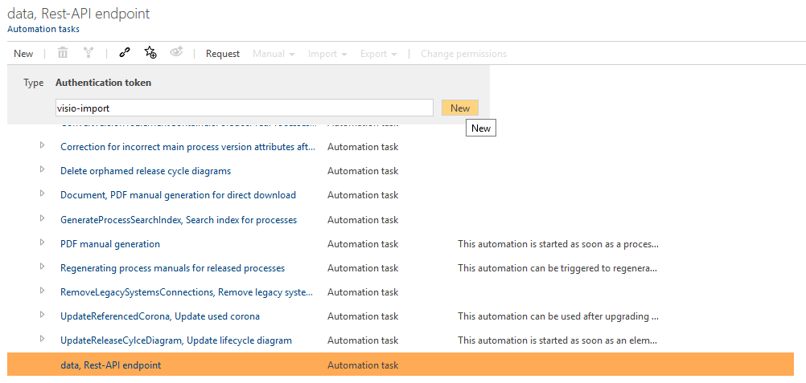
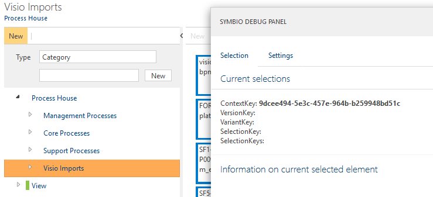
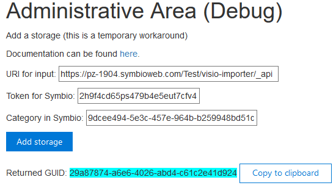
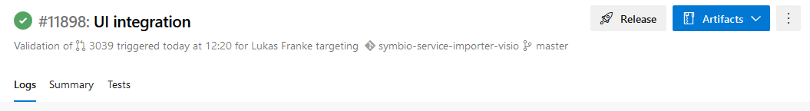
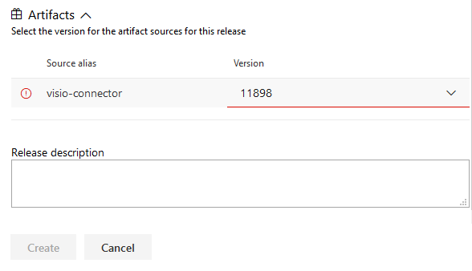
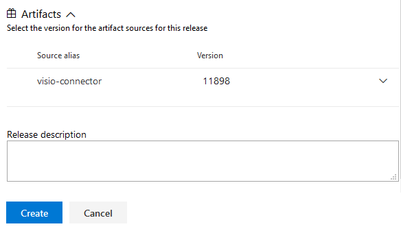

# Setting the Visio importer up

## URI und Token

First, navigate to the 'Automation Tasks' overview. (Admin settings panel > Services > Automation Tasks)  
Select the 'data, Rest API endpoint' task and create a new 'Authentication token' for it.

Select the token and copy the ID displayed on the right.  
Then scroll down to 'Application roles'. Expand it and check the 'Administrator' box.  
If you want to change the token's lifespan (default is 3 months), you can do so in the collapsed 'Validity' field further down below the ID field.

Besides the token an URL is needed for the import. The URL is the base URL to your Symbio instance appended with '_api'. (In our case "https://pz-1904.symbioweb.com/Test/visio-importer/_api".)  
You can also retrieve the URL from token's 'Information' section, just remove everything after '_api' from the URL.

The last thing we need is the GUID for the category in Symbio we want the import to end up in.
Go to your Symbio installation and create a new category or select an existing one and press `ctrl + alt + d`.

Select the 'ContextKey' GUID from there and copy it.

The Token, the URL and category GUID are added to the Tool using the [Website](https://visio.symbioweb.com/home).  
This returns a GUID which is needed by the user to complete an import.

## Website build and deploy process

To update the website, first push your commits onto the master or develop branch (builds are automated there) or queue a build manually after pushing to a different branch.
Once the build completed, press the 'Release' button in the build overview.

Scroll to the bottom in the opened overlay. You will see that the version of the source alias 'visio-connector' is highlighted red.

This is a bug and can be worked around by selecting an older version and then again the newest, or writing a blank space after the underlined version and removing it again.
The version should no longer be underlined and the 'Create' button clickable.

Create the release and wait until the deploy finished. The website is now updated.
